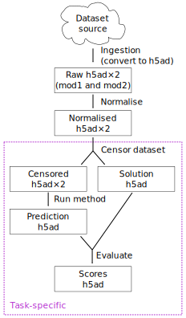

This repository contains viash components for running the
NeurIPS2021-OpenProblems benchmark pipeline for evaluating Multimodal
Data Integration methods.



## Building the pipeline components

Download NextFlow, viash and helper components by executing:

``` sh
bin/init
```

Build all components and Docker containers (might take a while the first
time around):

``` sh
bin/viash_build
```

↑ be sure to not forget the underscore in this command!

## Generating test datasets

The following scripts can be used to generate the test datasets.

``` sh
resources_test/run_common.sh
resources_test/run_task1.sh
```

Please don’t commit anything in `resources_test` unless something new
has been added!

## Running an individual component

You can run an individual viash component using the `viash run` command:

``` sh
viash run src/common/datasets/download_10x_dataset/config.vsh.yaml -- \
  --id pbmc_1k_protein_v3 \
  --input https://cf.10xgenomics.com/samples/cell-exp/3.0.0/pbmc_1k_protein_v3/pbmc_1k_protein_v3_raw_feature_bc_matrix.h5 \
  --output output.h5ad
```

Or if you already ran `bin/viash_build`:

``` sh
target/docker/common_datasets/download_10x_dataset/download_10x_dataset \
  --id pbmc_1k_protein_v3 \
  --input https://cf.10xgenomics.com/samples/cell-exp/3.0.0/pbmc_1k_protein_v3/pbmc_1k_protein_v3_raw_feature_bc_matrix.h5 \
  --output output.h5ad
```

Also check out the component’s help page:

``` sh
target/docker/common_datasets/download_10x_dataset/download_10x_dataset
```

## Running the whole pipeline

You can run the full nextflow pipeline by running the following scripts:

``` sh
src/common/workflows/generate_datasets/run.sh
src/predict_modality/workflows/run_task1_benchmark/run.sh
```

Update: This will not work! The Nextflow files are out of date, I need
to update them.

## More information

For more information on how to use `viash run`, `viash build` and
`viash test`, please take a look at the documentation at
[viash.io](https://viash.io).
